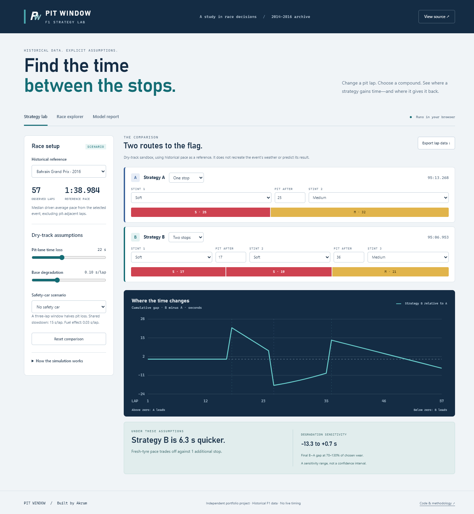

# Pit Window · F1 Strategy Lab

An interactive pit-stop strategy sandbox, a historical race explorer, and a
machine-learning evaluation that keeps entire seasons apart.

I built this from my final-year F1 project. My focus is not just
“which model scores highest?” but **what can these data actually support?**

[Open the interactive demo](https://akrouma03.github.io/formula1-strategy-prediction/) ·
[Methodology](documentation/methodology.md) ·
[Data-cleaning case study](documentation/data-case-study.md) ·
[Measured results](reports/metrics.json)



## Try it in a minute

In the demo, change Strategy B’s first pit lap, move the degradation slider,
then place a safety-car window over a stop. The cumulative gap shows when a
strategy pays the cost of a stop and whether fresh tyres recover it.

Four views keep different kinds of evidence separate:

- **Strategy lab:** compare two editable one-/two-stop plans, change dry compounds,
  pit loss and degradation, inspect sensitivity, and export every simulated lap.
- **Race explorer:** inspect recorded stints and pit-filtered lap pace for 21
  events in 2016. Missing records and detected source inconsistencies stay visible.
- **Model report:** inspect chronological test results, useful baselines,
  unseen tyre labels and per-race uncertainty.
- **Data & research:** see the manual-curation case study, recovered driver
  matches, dataset versions, measured stint trends and experiment exclusions.

The simulator is an illustrative single-car model, **not an optimiser or a
current-F1 prediction service**. Its coefficients are editable assumptions,
not fitted tyre physics. The three historical ML tasks are evaluated separately.

## Measured results

Candidates train on **2014**, selection uses **2015**, the selected method refits
on **2014–2015**, and evaluation uses **2016**. Entire events stay together.
Random Forest, Gradient Boosting and a simple baseline compete; the baseline
is allowed to win.

| Task | Selected method | 2016 result | Baseline result | Test records |
|---|---|---:|---:|---:|
| First two observed stint compounds | Gradient Boosting | 22.3% accuracy | 20.4% | 431 |
| Finish among classified drivers | Random Forest | 2.74-place MAE | 3.07 places | 382 |
| Pit-filtered mean lap time | Circuit/condition baseline | 5.52-second MAE | 5.52 seconds | 373 |

Lower MAE is better. Each task covers 21 test events. The tyre baseline uses the
training-data mode for the circuit/conditions; pace uses the median; finishing
position uses the grid slot. Circuit-only and global fallbacks handle missing
combinations.

**What I learned:** 106 of 431 test tyre sequences were absent from the
development seasons. The selected tyre classifier’s accuracy falls from 46.9%
on validation to 22.3% on the later season. More model complexity does not solve
that distribution shift. The pace baseline beating the learned candidates on
validation is a result worth reporting, not hiding.

These replace earlier random-row results: rows from the same race appeared
in both train and test, making the old numbers an unsuitable measure of
future-race performance. The archive has been inspected during development;
2016 is excluded from candidate selection, not claimed as a pristine blind
benchmark. [Full protocol and limitations](documentation/methodology.md).

## The data work

I manually cleaned the original archive. I've kept two selected snapshots
unchanged and added checks that make their limitations auditable:

- **16 CSV files, 10 distinct byte contents:** a checksum-based catalogue
  separates copies and feature exports from new observations; five private
  workbooks are catalogued by metadata only.
- **88 recovered driver–race matches:** explicit aliases replace brittle
  exact-name joins. One conflicting source record remains excluded.
- **2,078 analysed stints:** exact pit-boundary checks and robust within-stint
  pace slopes. The selected compound lookup does not beat zero drift in 2016,
  so the simulator remains illustrative rather than claiming fitted tyre wear.
- **Honest model comparisons:** all RF/GB/baseline results are visible. Selected
  old LSTM/GRU experiments are audited, not presented as valid benchmarks.

The richer `F1_data.csv` has useful columns but no season identifier and 8,413
exact duplicate rows. It is not silently merged into the historical dataset.
In the [case study](documentation/data-case-study.md), I explain my original
manual work, what I can verify from the files, and the automated checks I've
added. I don't have a complete log of every historical manual edit.

## Run locally

The browser demo needs no API keys, backend, npm installation or model files:

```bash
git clone https://github.com/Akrouma03/formula1-strategy-prediction.git
cd formula1-strategy-prediction
python -m http.server 8000 --bind 127.0.0.1 --directory docs
```

Open `http://127.0.0.1:8000`. Serve over HTTP; opening `index.html` directly
will prevent the browser from loading its JSON files.

### Reproduce the Python evaluation

Python **3.10–3.12**:

```bash
python -m venv .venv
# macOS / Linux
source .venv/bin/activate
# Windows PowerShell: .\.venv\Scripts\Activate.ps1

python -m pip install -e ".[dev]"
python scripts/train.py
python scripts/predict.py --race Monaco --position 3 --condition Wet --json
python scripts/build_research.py
python scripts/export_demo.py
python scripts/export_demo.py --check
```

Training writes local, ignored `models/*.joblib` bundles and a versioned
`reports/metrics.json`. Exporting refreshes the demo’s allowlisted JSON data.
`--task positioning` retrains a single task without erasing the others; source,
pipeline or dependency changes require a full retrain. Research generation
needs only the two public curated files, not the private archive.

Prediction deliberately supports **2016 historical scenarios only**. All three
tasks use the same grid, canonical circuit ID and assumed conditions—never
predicted finishing position as an input to pace. The bundles retain their
2014–2015 fit so they remain consistent with the reported evaluation.

Only load joblib files you built yourself; pickle-based artifacts can execute
code. If installing a wheel instead of using this checkout, set
`F1_STRATEGY_ROOT` to the checkout path so the package can locate data and
write local artifacts.

## Engineering and verification

```bash
python -m ruff check src scripts tests
python -m ruff format --check src scripts tests
python scripts/check_public_files.py
python -m pytest
python -m build
npm ci
npm test
npm run format:check
npx playwright install chromium
npm run test:e2e
```

Tests cover circuit aliases, retiree eligibility, true lap adjacency, invalid
inputs, held-out season boundaries, artifact round-trips, target isolation,
export validation, exact simulator arithmetic, CSV output, keyboard navigation,
mobile layouts and accessibility. CI runs Python on Linux and Windows, then
checks the real demo in Chromium before Pages can deploy from `main`.

### Project map

```text
src/f1strategy/     validated data, shared features, evaluation and artifact API
scripts/           training, historical CLI, browser-data export
docs/              dependency-free static app + tested simulation engine
documentation/     methodology and operational notes
tests/             Python data, model and CLI regression tests
tests-js/          simulator tests using Node's built-in runner
tests-e2e/         real-browser behaviour and accessibility tests
data/curated/      selected manually curated CSV snapshots (unchanged bytes)
data/catalogue.json  private archive metadata, versions and source evidence
experiments/       comparable results and legacy experiment audit
reports/           generated evaluation JSON, not the academic report
```

The frontend uses native HTML controls, keyboard-operable tabs, labelled SVG
charts and local system fonts. No trackers or third-party runtime requests.

## Boundaries and next experiments

This is a small, imperfect 2014–2016 archive, not a complete official timing
feed. Weather is known retrospectively; using it is a scenario assumption.
There are no track-status flags, so pit-filtered pace is **not green-flag pace**.
Car/team performance, traffic, overtaking, tyre inventory and sporting legality
are outside the simulator. Finishing-position evaluation excludes non-numeric
finish statuses and does not estimate retirement risk.

A meaningful next version would recover provenance and season IDs for richer
timing data, reserve a genuinely new season, model retirement separately and
separate tyre wear from the confounders exposed by the completed stint study.
Sequence modelling and pit-window optimisation remain next experiments.

## Data and license

Code: [MIT](LICENSE). The academic report, credentials and trained pickle files
are not part of this public repository. Original dataset provenance and
redistribution terms were not fully recorded; the code license does not relicense
third-party source material. See [data notes](data/README.md).
